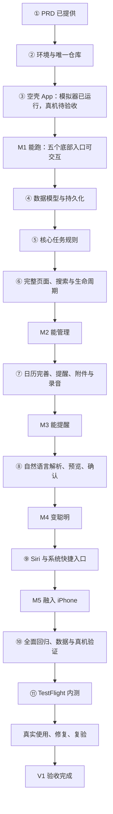

# 次第 V1 开发路线与验收基线

基线日期：2026-09-19。依据：《次第_V1_PRD.docx》（V1.0 / 功能冻结版）及产品负责人本次开发路线要求。

本文固定交付顺序、职责和验收门槛，不代表所有功能已实现。2026-09-19 首次整理时仅建立计划；后续实施状态以以下进展记录为准。PRD 是产品需求来源；文档内的实施建议不等于对外发布、购买服务或修改账号的授权。

## 最新进展（2026-09-20）

- 唯一远程仓库已建立并完成首次推送：`weizheIP/manager`，基线提交 `6684730`。
- 已沿用现有工程，显示名为“次第”；Bundle ID 暂沿用 `cn.beiminge.manager`，最低 iOS 26.2，配置个人开发团队。
- 用户选择先使用模拟器调试。iOS 平台组件已安装，iPhone 17 Pro 模拟器可运行 App，Xcode 调试入口已验证。
- 本次实现总览、任务栏、日历、人员四个页面及中央“＋”创建卡片。所有内容明确标为功能预览；没有持久化、实际创建或 AI 请求。
- 模拟器编译、页面切换、中文输入、关闭返回原页面、中文日期和深色模式已验证；详细证据及限制见 [M1 导航检查记录](M1_导航检查记录.md)。
- 当前进入 **M1 导航骨架的模拟器验收**。真机安装、同事代码审核及完整 M1 验收仍未完成，不以模拟器运行替代真机通过。
- 下一个小任务：先确认这版导航体验，再制定并审核本地数据模型；不会自动展开后续所有里程碑。

## 1. 初始环境记录（2026-09-19）

| 项目 | 已核实状态 | 下一项核实 |
| --- | --- | --- |
| PRD | 已提供 V1 功能冻结版 | 按本文逐项映射验收 |
| 本机 | Apple M1 Pro、macOS 15.7.5、Xcode 26.3 | 目标 iPhone 型号与 iOS 版本 |
| 工程 | 已存在 manager/manager.xcodeproj | 是否沿用为空壳起点；建议沿用并在 M1 调整品牌信息 |
| Git | manager 是本地仓库，main 分支，已有 ada0ac1 首次提交；检查时工作区干净 | 确定唯一 GitHub 仓库 |
| 远程仓库 | 用户已指定 https://github.com/weizheIP/manager.git，已配置为 origin | 首次推送验证、同事访问权限 |
| 当前工程标识 | cn.beiminge.manager，最低 iOS 26.2 | 正式 Bundle ID、开发团队、最低系统版本 |
| 真机与签名 | 尚未验证 | 实机连接、开发者模式、签名及安装 |

记录时处于 **② 开发环境 / 唯一仓库**。未核实同事的另一台 Mac；不能把本机检查结果当作同事设备已验收。

Xcode 内置 AI 助手是否启用，不作为本项目开工门槛。先用现有 Codex 配合 Xcode；若未来接入内置助手，再独立处理其系统要求。

## 2. 固定的大路线

M1 只做可交互的导航骨架，M2 再填充真实业务，避免把五个入口的验收拖到所有功能完成之后。“＋”是创建动作：弹出轻量卡片，不是独立内容页。日历在 M2 展示真实 DDL，在 M3 完成提醒联动与边界验证。

测试贯穿每一步；⑩ 是集中回归，不是第一次开始测试。Siri 正式接入保持在 M5，前期只记录系统约束及能力风险。

## 3. 三方职责

| 角色 | 负责 | 验收或审核边界 |
| --- | --- | --- |
| 产品负责人（用户） | 产品取舍、交互体验、真机试用、里程碑验收 | 判断是否符合需求、是否顺手；批准范围变化 |
| AI / Codex | 拆小任务、实现代码、解释变更、定位问题、设计并执行可运行的检查、维护文档 | 给出检查证据和未验证项；不能以模拟器结果冒充真机通过 |
| 程序员同事 | 环境与签名、架构审核、代码审查、疑难问题、发布支持 | 审核数据模型、系统能力、AI 接口和发布等关键变更 |

产品负责人不承担 Swift 代码专业性判断。同事审核也不替代产品负责人的体验验收。

## 4. 里程碑与通过标准

### M1：能跑

顺序：环境核对 → 唯一仓库 → 明确工程起点 → 首次真机打开 → 五个底部入口。

- 保留现有工程与 Git 历史，默认评估沿用；若确需重建，先记录理由和唯一工程位置，避免两套工程同时推进。
- 正式确定显示名“次第”、Bundle ID、最低 iOS 版本和签名团队。
- 目标 iPhone 能安装并打开 App；拔线后可以再次启动。
- 总览、任务栏、日历、人员可以切换；“＋”能打开并关闭创建卡片。占位页面明确标注尚未实现。
- 保存真机截图、设备/系统版本、构建版本及对应提交；用户确认导航可用。

**通过门槛：** 同事从唯一仓库取得同一版本后可构建，用户手机上可以完成上述操作。模拟器运行不等于 M1 完成。

### M2：能管理

按以下小批次推进，每批次都走第 6 节的小循环：

1. 数据设计：任务栏、任务、步骤、人员、负责人关联、DDL、提醒、附件均有稳定身份；定义本地存储和数据版本方案。姓名不作为关联键，附件元数据与文件位置分离。
2. 最小闭环：只填任务名称即可保存、查看、编辑；退出并重新启动后仍保留。
3. 任务栏：创建、改名、排序、归档、删除；任务手动排序保持；任务栏同级，无额外上级文件夹。
4. 任务和步骤规则：四种状态、未分类与四象限、等待原因、多负责人、每人独立或为空的 DDL；步骤自动编号与拖动排序、并行、多个前置步骤、软依赖提示。
5. 共用详情：总览、任务栏、日历、人员和搜索均打开同一任务详情；步骤和个人 DDL 可以定位到对应内容。
6. 页面：总览固定顺序、人员负载、日历月/周视图和三类 DDL 筛选；全局搜索覆盖当期已有字段。
7. 生命周期：完成、归档、废纸篓相互区分；归档可搜索和恢复，删除保留 30 天可恢复；到期清理规则与附件关系一并设计。

**必须验证：**

- DDL 超时只显示逾期事实，不自动改变状态、象限、负责人或象限颜色。
- 每个任务/步骤支持 0～N 个负责人；总任务、步骤、个人 DDL 不混淆。
- 前置未完成时提示风险，但仍能继续；步骤全完成不自动完成总任务；有未完成步骤时完成总任务会二次提示。
- 完成不自动归档；排序与编辑在重启后保留。
- 首页道德经来自已校对原文库，含章节与简短白话；今天重点与明天起未来 7 天到期项不重复计算。
- “交给 AI 做”仅为象限行动标签，不触发 AI 执行；“我”和“AI”不设为特殊负责人。

**通过门槛：** 用户不依赖 AI 或 Siri，即可管理真实事务；核心规则测试和同事架构审核通过。

### M3：能提醒

顺序：普通提醒 → 强提醒真机验证与集成 → 图片/文件 → 录音 → 完整联动。

- 三类 DDL 均可有多条提醒，偏移单位为分钟、小时、天、周；每条独立选择普通/强提醒。
- 在实际支持的系统和权限条件下验证强提醒。AlarmKit 作为候选方案，正式选型与支持范围由技术验证决定；不能用普通通知冒充强提醒。
- 权限拒绝或能力不可用时，明确告知、保留用户意图并提供可用选项；不得静默改变提醒类型或宣称调度成功。
- DDL 修改、完成、归档、删除、恢复时，提醒取消/重排策略明确并经过验证；具体归档提醒语义在实现前由产品负责人确认。
- 任务与步骤均支持文字、图片、文件和录音；文件能保存、预览或交由系统打开，附件文件名纳入搜索。
- 验证锁屏、后台、重启、通知拒绝、时区改变及重复调度；记录实际表现和系统限制。
- 验证废纸篓恢复能找回附件，到期清理不留下孤立文件；本地数据不被无意上传。

**通过门槛：** 真机上的提醒和附件完整闭环成立。若强提醒无法达到商定要求，记录为未通过或由产品负责人明确调整范围，不能直接勾选完成。

### M4：变聪明

- “＋”始终支持只填名称的普通创建；App 内麦克风入口可录入语音，识别结果可编辑。
- 自然语言流程固定为：输入 → 解析 → 预览 → 用户修改/确认 → 创建。
- 只提取明确表达的信息；未表达字段保持为空。任务栏或人员存在重名、未匹配或日期歧义时，在预览中让用户选择。
- 同一创建规则同时服务手动与 AI 入口；取消预览不写入，连续点击确认不重复创建。
- AI 服务错误、超时、断网和语音权限拒绝时仍能手动创建。
- 实现前明确 AI 服务方案、成本、数据发送范围；生产服务密钥不放在 App 包或 Git 中。用户确认创建与同意发送内容进行解析是两个不同环节。
- 用 PRD 附录 A 和缺字段、重名、相对日期、取消确认等用例验收；记录输入时间和时区，避免“明天”漂移。

**通过门槛：** 自然语言结果可核对、可修改、确认后才创建，不出现凭空填字段或意外写入。

### M5：融入 iPhone

- 接入 App Intents / App Shortcuts / App Entity，复用已经稳定的任务与创建规则。
- 真机验收三个入口：“用次第记任务”“用次第往「任务栏」记任务”“用次第记一下”。
- 验证任务栏选择、自然语言预览与未分类快速收集的不同路径；不因入口差异创建第二套数据。
- 记录实际支持的系统、语言、锁屏状态、可用短语与交互限制。系统无法完成某个环节时，交接到 App 内继续并保留已收集内容。
- Siri 不可用时，App 内普通创建和麦克风入口仍可用。

**通过门槛：** 三个场景的实机路径与产品负责人约定一致。系统能力与 PRD 存在差异时显式评估，不能把“打开 App”当成全部 Siri 需求已完成。

## 5. V1 发布验收

M5 完成后进入集中回归与 TestFlight，不将 App Store 公开上架自动加入本次范围。

1. **功能回归：** 覆盖 PRD 第 17 节全部核心验收及附录 B 全部页面，包括设置/Siri 引导、归档、废纸篓。
2. **数据验证：** 新装、升级、重启、旧版本数据迁移、排序、关联关系、附件完整性、30 天恢复与到期清理。以升级安装检查数据保留，不能通过卸载重装掩盖迁移问题。
3. **稳定性与体验：** 真机崩溃、长列表性能、中文输入、滚动、空状态、权限拒绝、断网；字体放大和关键标签可读。
4. **发布准备：** 确认 Apple Developer Program 团队、App Store Connect 权限、Bundle ID、签名、版本号、实际数据处理说明和测试说明。
5. **TestFlight：** 上传可追溯构建，完成适用的处理/审核流程，测试者实际安装；邀请方式按内部/外部测试者资格选择。
6. **真实使用：** 建议连续 7 天日常使用，作为待产品负责人确认的观察窗口；问题带复现步骤、设备/系统、构建版本。修复后重测受影响功能。

**V1 完成条件：** PRD MUST 逐项通过或存在产品负责人明确批准的范围变更；无已知阻塞使用、崩溃或数据丢失问题；关键变更完成同事审核；用户验收通过；发布版本、提交、测试记录和已知限制可追溯。保留对应版本标记，具备代码回退及数据兼容说明。

TestFlight 是本路线的内测分发终点，上传成功本身不等于 V1 完成。免费 Apple 账号可进行自己的设备测试，TestFlight 分发需开发者计划资格；账号与会员准备应提前安排，避免最后卡住。

## 6. 每个功能只走一个小循环

**一个小任务 → AI/同事实作 → Xcode 构建 → 自动检查（适用时）→ 真机体验 → 修复复验 → 审核 → Git 提交/同步 → 下一小任务。**

每次任务卡固定写清：目标、改动范围、前置条件、3～5 项验收动作、执行人与审核人、检查证据、未解决问题、提交编号。用户体验有问题就继续修；不能以“代码生成完”标记完成。

Git 约定：main 保持可构建；小任务使用短功能分支；关键变更经同事审核后合并。通过一个小任务就形成可追溯提交，不把多个未验证功能堆成一次大提交。失败尝试如需保存，留在功能分支并标明未通过。

不预填虚假的完成日期。按验收门槛推进；M1、M2 通过后，结合实际速度更新后续时间估算。

## 7. ② 环境 / 唯一仓库的原始执行清单

以下保留初始执行清单；后续完成情况见文首“最新进展”和检查记录，同事环境验证仍待进行：

- [x] 核对本机 Xcode、已有工程与本地 Git 状态。
- [ ] 记录目标 iPhone 型号、iOS 版本；同事核对其实际开发机器。
- [x] 用户已确定唯一 GitHub 仓库：https://github.com/weizheIP/manager.git；仓库可见性以现有设置为准。
- [ ] 确定唯一工作目录。建议沿用 manager 本地仓库，后续在 M1 处理产品显示名与工程命名；不要在上级目录再初始化嵌套仓库。
- [ ] 检查提交内容与 .gitignore，排除构建产物、用户本地设置、密钥和真实用户数据；PRD 与本路线作为产品基线纳入仓库。
- [ ] 配置远程，推送基线，确认网页可见且同事可获取同一提交；若已有远程历史，先核对再衔接，不覆盖历史。
- [ ] 记录最低 iOS 版本、Bundle ID 和签名团队的待定/确认状态；团队由同事核实，不根据模板配置推断已设置。
- [ ] 同事从唯一仓库拉取后能打开工程，核对构建环境，记录结果。

**② 完成证据：** 一个明确的仓库 URL、唯一工程路径、双方一致的基线提交，以及环境/账号/真机条件清单。全部核对后，下一次才进入 ③ 首次真机打开。

## 8. 需要在相应阶段前定下来的事项

| 事项 | 最晚决策点 | 负责 |
| --- | --- | --- |
| GitHub 归属和地址、沿用现有工程 | ② 执行前 | 用户确认归属，同事/AI 核实技术状态 |
| iPhone/iOS、最低系统、Bundle ID、签名团队 | M1 实作前 | 用户提供设备，同事审核 |
| 本地持久化选型、日期/时区语义、关联删除与迁移策略 | M2 数据模型落地前 | 同事审核，AI 起草；涉及体验由用户确认 |
| 强提醒的准确体验与支持范围 | M1 后尽早做能力验证，M3 集成前定案 | 同事验证，用户验收；本轮不做代码验证 |
| 归档/完成/删除后的提醒和恢复规则 | M3 提醒联动前 | 用户确认业务语义 |
| AI 服务、成本及内容发送范围 | M4 接口实现前 | 用户确认，同事审核 |
| 开发者计划资格、TestFlight 测试人员 | M1 核对状态，TestFlight 前备齐 | 用户与同事 |

范围固定为单管理者、本地数据、iOS 首发。多人账号/协作、云同步、其他平台、聊天与权限体系、AI 自动执行、甘特图、小时日程、OCR、录音内容搜索和附件全文检索均保留到后续版本。

新增需求进入待办池。只有产品负责人明确批准并同步更新需求、路线和验收项后，才改变 V1 范围。

## 9. 依据

- 产品基线：[次第_V1_PRD.docx](次第_V1_PRD.docx)，从用户提供的原件复制，内容未改写。
- [Apple：AlarmKit](https://developer.apple.com/documentation/alarmkit)：支持系统闹钟的调度、授权和界面；具体产品适配留待真机验证。
- [Apple：开发者计划](https://developer.apple.com/programs/)：区分个人设备测试与 TestFlight 分发资格。
- [Apple：TestFlight](https://developer.apple.com/testflight/)：内外部测试流程与测试者管理。

外部文档核对日期：2026-09-19。API、账号与分发要求在对应实施阶段再次确认。
